# project-01
Andrew Middleton and Scott Kutlick

## Project Proposal
Our company wants to partner with a film studio to make a high grossing movie. Looking at the data from our *blockbusters.csv* file, we are examining the genre's, IMDb Rating, length, MPAA rating (G, PG, PG-13, and R), studio, title, worldwide gross, and year. 

Our overarching question was:
>What kind of movie should we make that has the potential to make the most money?

The other questions we asked were:

>What rating should it have?
>
>Should it be animated or live action?
>
>Which production company do we want to go with?
>
>What genre should it be and what two sub-genres should it be?
>
>How long should it be?
>
>Does the IMDb Rating have any correlation on the gross earnings?

## Data Analysis 

First, we looked at the MPAA ratings to see which rating generated the highest grossing movies over the years.

    

Next, when looking at the progression of the word wide gross live action vs. animation we can see the projection over the years how much they made to decide whether we should do an animated movie or a live action movie.

    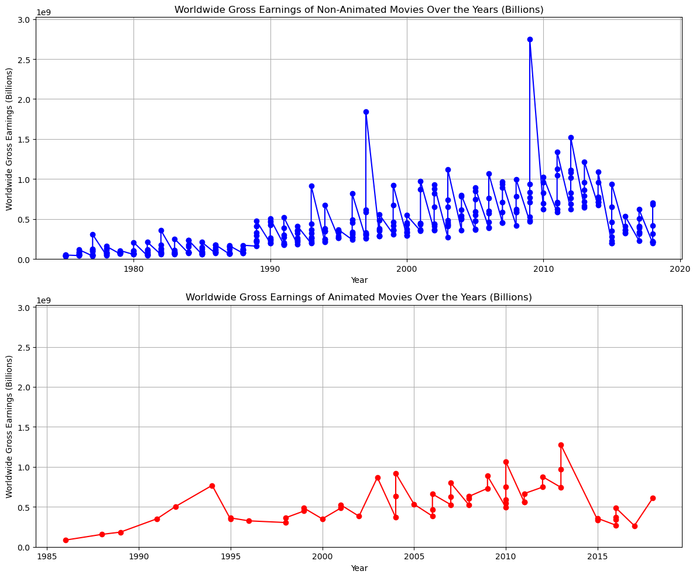

To decide what production company to partner with we looked at the average worldwide gross for each production company.

    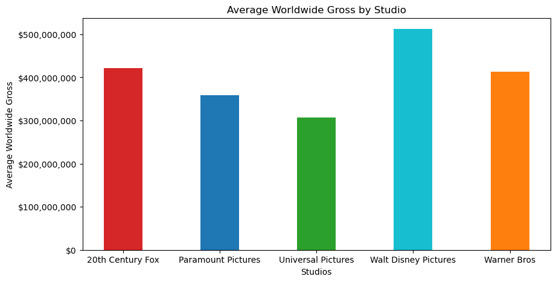

For what genre and sub genres we should do. We looked at all the genres to see which genres had the highest gross.

    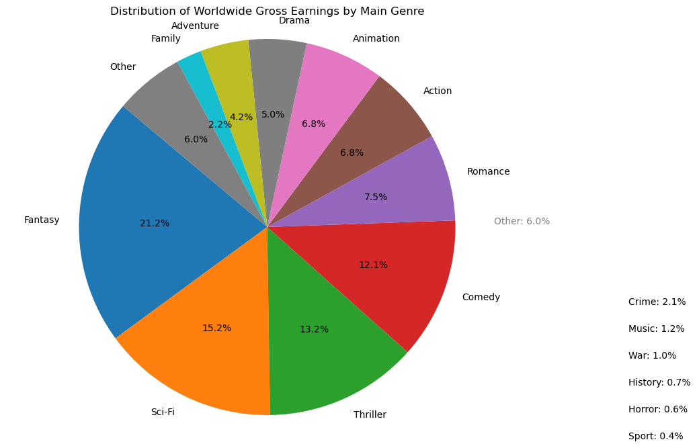

    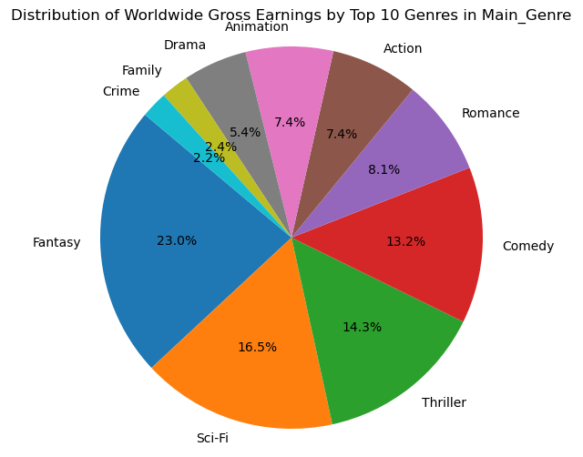

    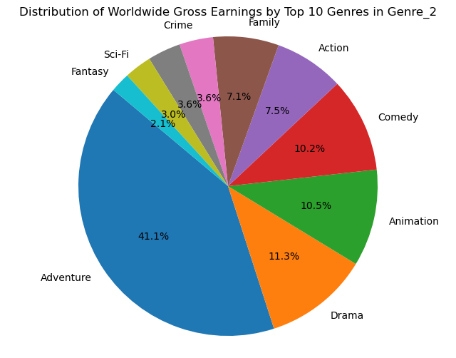

    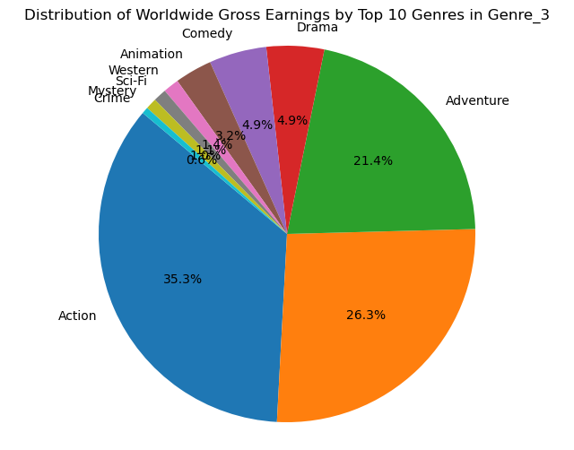

This shows the highest grossing multiple group genres.

    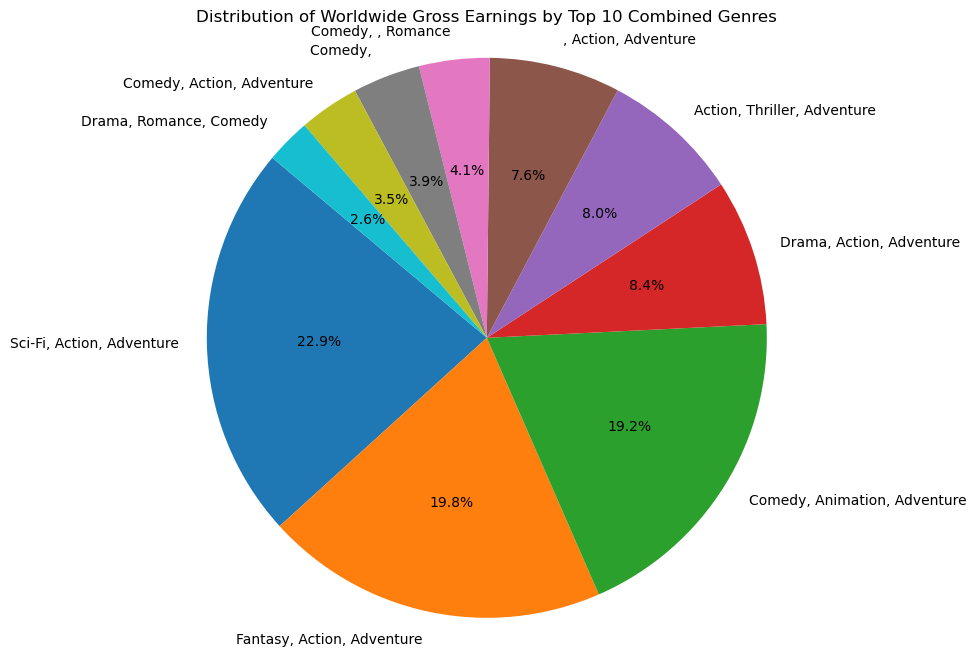

We looked at the length of the movie compared to the highest gross.

    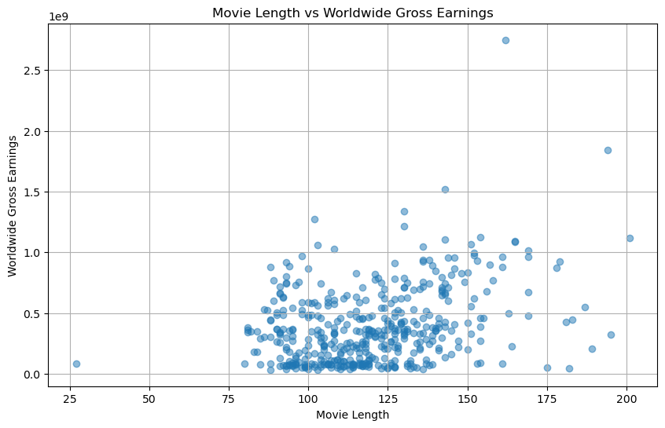

This shows the average movie length per year as well.

    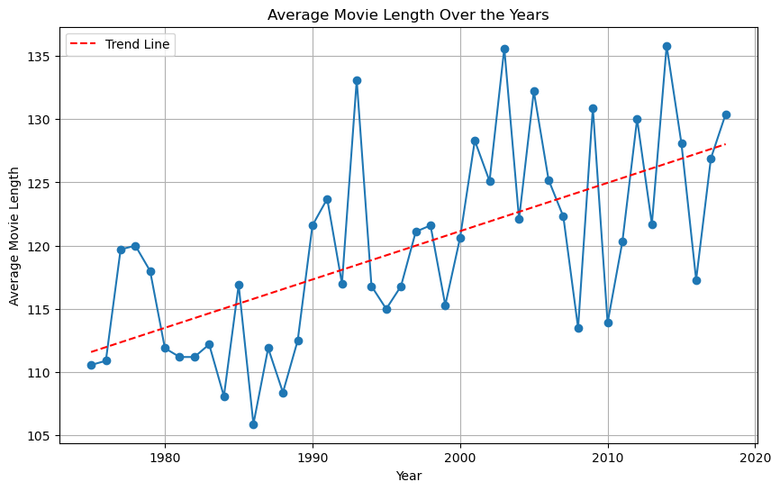

We also analyzed which studios tend to put out higher audience rated films, which could help assist in our ultimate decision.  

    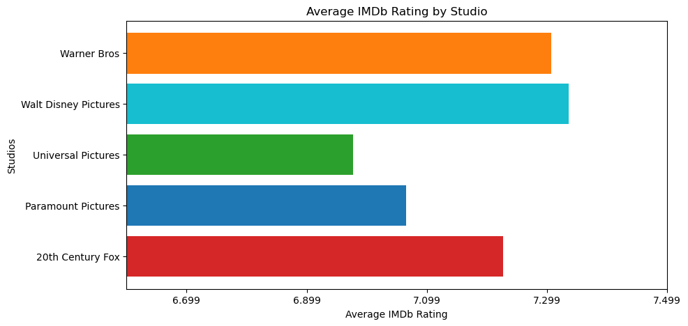

Looking specifically at just the genres under Walt Disney Pictures, we can see a wide breadth of offerings.   

    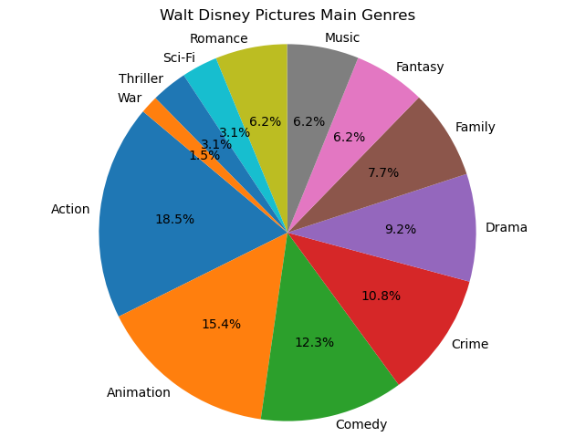

Looking at the charts we came to several conclusions for the answers to our questions.

>What rating should it have?

R is out of the question and has a very selective audience. If we do animation G or PG would be a good option, keeping it light and family friendly. PG-13 is the most highly profitable over the years and it is a good rating for live action.

>Should it be animated or live action?

It could go either way because overall they are about the same trend wise. However, the top grossing for the highest animation movie is lower than a few live action movies. With that consideration, live action would be the way to go.

>Which production company do we want to go with?

Warner Brothers does Sci-Fi while Disney does Marvel. According to the data and trend of each company, we should go with a Marvel-style superhero movie with Disney.

>What genre should it be and what two sub-genres should it be?

Overall, with different charts with the data adventure is the most frequent. The most successful genres are adventure, action, fantasy, and sci-fi. With Star Wars, the lord of the rings, Harry potter, Marvel, spy movies, dystopian movies, and pirates of the Caribbean. The genres for our movie that have the most successful data are fantasy, action, and adventure or sci-fi, action, and adventure. The storyline that these movies produce create interesting worlds beyond wildest dreams, compelling characters, and action scenes that the audience love to see creating high stakes and making it harder for the hero. It also shows good character development and growth. Sci-fi could be easier than fantasy and have a lower budget than trying to create a fantastical world make the movie cost more causing our budget to be higher and not making as much money.

>How long should it be?

The trend line over the years shows the movies getting longer and with the higher grossing films have longer run times from the 2-hour mark to around the 3-hour mark.

>Does the IMDb Rating have any correlation on the gross earnings?

We ran multiple statistical tests to determine the correlation within the dataset comparison of IMDb Rating and gross earnings.  The results indicate a correlation coefficient of nearly 0.3.  

## Decision
>What kind of movie should we make that has the potential to make the most money?

A Disney Superhero movie that falls under the Sci-fi, Action, and Adventure genres, is over 2 hours long, rated PG-13, and live-action.

## Final Comments & Takeaways
As we progressed on the project, we noticed that there a additional considerations that should be factored into this decision that wasn't present in our existing dataset.  For example, it would be have been beneficial to also include attributes such as Release Date, Directors / Actors, and a Geographic Breakdown of Earnings.  Each one of those attributes could have further narrowed down our decision.  

Another item that we noticed in our dataset was that the worldwide gross earnings was not inflation-adjusted, therefore we are unable to perform a robust comparison across years.  

Furthermore, the analysis only included gross earnings, not net income.  In making a more informed decision, it would be worthwhile to include budget and other expenses in the analysis.  